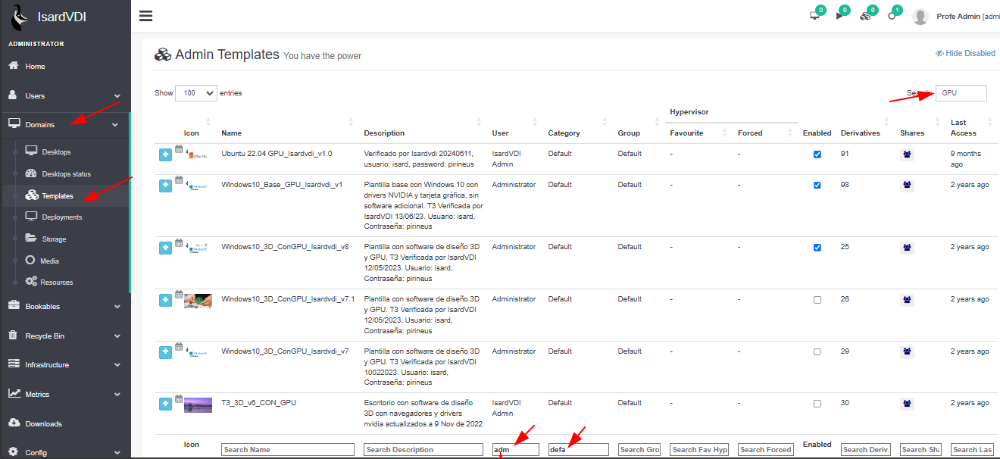

# Actualizar plantillas - cambio de vCPU, RAM y GPU

Al añadir nuevas tarjetas gráficas hay que actualizar / asociar las plantillas anteriores a los nuevos recursos.

Necesitas un rol de **Administrador**

Acceder a la administración > DOMAINS > TEMPLATES

Localizaremos todas las plantillas que hay que modificar.

Filtrar por:

* usuario: **Admin o Adminsitrator**
* plantillas con **GPU** (tienen icono calendario)
* y **HABILITADAS**

Una vez localizada, se modifica las características de HW.

Establecer:  **6 CPU |  16GM RAM | GPU NVIDIA A16 4Q - NVIDIA vGPU A16 with profile 4Q**

En la siguiente animación se ve el proceso:

## vCPUS, RAM y GPU:

**GPU NVIDIA A16 4Q - NVIDIA vGPU A16 with profile 4Q**

**6 CPU |  16GM RAM**

