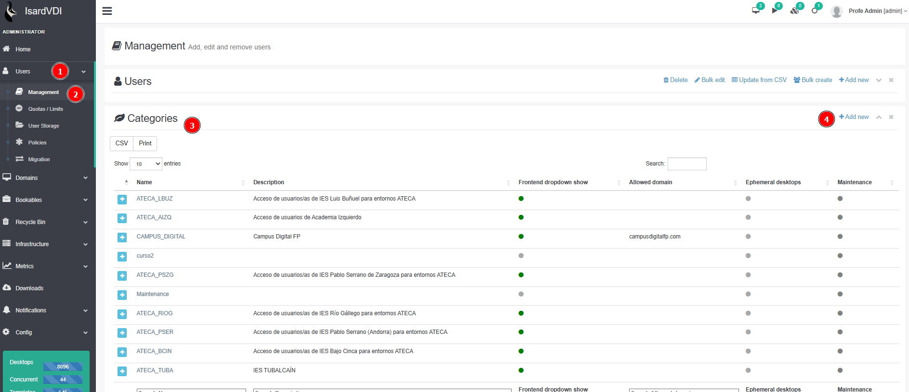

# Introducción
El servicio de escritorios virtuales basado en el programa IsardVDI es un proyecto que está dando servicio a centros educativos de formación profesional en la comunidad autónoma de Aragón.
El proyecto se encuentra enmarcado dentro de la iniciativa de conversión de espacios en aulas de tecnología aplicada (ATECA), donde los centros elegidos han colaborado para dotar a esta infraestructura de hardware y software profesional que pueda contribuir a la transformación tecnológica de la FP de manera transversal, impactando en todas las familias profesionales y no solo en las de carácter más tecnológico.
Esta iniciativa está impulsada por el Ministerio de Educación y Formación Profesional y financiada por la Unión Europea (fondos NextGenerationEU) e implantada en Aragón a través de la Dirección General de Innovación y Formación Profesional, actualmente a través del centro de formación profesional Campus Digital.
De momento está disponible para 18 centros educativos así como para centros de formación (CATEDU) y de innovación (CIFPA) y se irá ampliando de manera progresiva según crezca la iniciativa y se pueda abrir a más centros. 
URL Acceso → [www.campusvdi.es] (https://www.campusvdi.es)
El acceso directo a la categoría / centro puede ser configurado de esta forma -> https://campusvdi.es/login/ateca_XXXX siendo XXX las 4 iniciales que corresponden al nombre / siglas del centro educativo. Ver listado en el desplegable situado en https://campusvdi.es/login 

# CREAR Centros nuevos en campusvdi

Inicialmente se crean:
1 manager (manager)
2 docentes (advanced)
20 estudiantes (user)

2 grupos: grupo01, grupo02

Todos los usuarios estan en el grupo Main. Los managers deberán de gestionar los grupos.

---

# Acceder a la administración con rol Admin

[https://www.campusvdi.es/login/form/default](https://www.campusvdi.es/login/form/default)

Acceder a la administración > Users > Management 

# Crear Categoría

**Administración > Users > Management > Categories > Add New**

**Rellenar: Nombre, Description, Custom URL, Frontend dropdown show**

# Crear Grupos

Se crean **2 grupos** (grupo 01 y grupo 02) por Centro además del que se crea por defecto Main

**Rellenar: Name, Description y seleccionar en el desplegable la categoría**

Filtrar por el código de centro para verificar que están los grupos creados

# Crear Usuarios

A partir de la plantilla de  CSV para crear usuarios, rellenar con los datos necesarios.

[update-from-csv-export (1).csv](update-from-csv-export_(1).csv)

| username | name | email | group | category | role |
| --- | --- | --- | --- | --- | --- |
| Estudiante-01 | Estudiante-01 |  | Main | ATECA_AIZQ | user |
| Estudiante-02 | Estudiante-02 |  | Main | ATECA_AIZQ | user |
| Estudiante-03 | Estudiante-03 |  | Main | ATECA_AIZQ | user |
| Estudiante-04 | Estudiante-04 |  | Main | ATECA_AIZQ | user |
| Estudiante-05 | Estudiante-05 |  | Main | ATECA_AIZQ | user |
| Estudiante-06 | Estudiante-06 |  | Main | ATECA_AIZQ | user |
| Estudiante-07 | Estudiante-07 |  | Main | ATECA_AIZQ | user |
| Estudiante-08 | Estudiante-08 |  | Main | ATECA_AIZQ | user |
| Estudiante-09 | Estudiante-09 |  | Main | ATECA_AIZQ | user |
| Estudiante-10 | Estudiante-10 |  | Main | ATECA_AIZQ | user |
| Estudiante-11 | Estudiante-11 |  | Main | ATECA_AIZQ | user |
| Estudiante-12 | Estudiante-12 |  | Main | ATECA_AIZQ | user |
| Estudiante-13 | Estudiante-13 |  | Main | ATECA_AIZQ | user |
| Estudiante-14 | Estudiante-14 |  | Main | ATECA_AIZQ | user |
| Estudiante-15 | Estudiante-15 |  | Main | ATECA_AIZQ | user |
| Estudiante-16 | Estudiante-16 |  | Main | ATECA_AIZQ | user |
| Estudiante-17 | Estudiante-17 |  | Main | ATECA_AIZQ | user |
| Estudiante-18 | Estudiante-18 |  | Main | ATECA_AIZQ | user |
| Estudiante-19 | Estudiante-19 |  | Main | ATECA_AIZQ | user |
| Estudiante-20 | Estudiante-20 |  | Main | ATECA_AIZQ | user |
| Profe-02 | Profe-02 |  | Main | ATECA_AIZQ | advanced |
| Profe-01 | Profe-01 |  | Main | ATECA_AIZQ | advanced |
| Manager_AIZQ | Manager_AIZQ |  | Main | ATECA_AIZQ | manager |

**Guardar como CSV separado por comas  >  Bulk create**

**Revisar datos Importar > Descargar claves > Crear usuarios**

# Actualizar Contraseñas Usuarios

El generador de claves establece unas contraseñas complejas, las cambiamos por **C@mbiame1!** e indicamos a los usuarios que la deben cambiar

**FILTRAMOS POR LA CATEGORIA y descargamos CSV para actualizar**

**Rellenamos los campos passwords**

| active | name | provider | category | uid | username | group | secondary_groups | password |
| --- | --- | --- | --- | --- | --- | --- | --- | --- |
| TRUE | Estudiante-01 | local | ATECA_AIZQ | Estudiante-01 | Estudiante-01 | Main |  | C@mbiame1! |
| TRUE | Estudiante-02 | local | ATECA_AIZQ | Estudiante-02 | Estudiante-02 | Main |  | C@mbiame1! |
| TRUE | Estudiante-03 | local | ATECA_AIZQ | Estudiante-03 | Estudiante-03 | Main |  | C@mbiame1! |
| TRUE | Estudiante-04 | local | ATECA_AIZQ | Estudiante-04 | Estudiante-04 | Main |  | C@mbiame1! |
| TRUE | Estudiante-05 | local | ATECA_AIZQ | Estudiante-05 | Estudiante-05 | Main |  | C@mbiame1! |
| TRUE | Estudiante-06 | local | ATECA_AIZQ | Estudiante-06 | Estudiante-06 | Main |  | C@mbiame1! |
| TRUE | Estudiante-07 | local | ATECA_AIZQ | Estudiante-07 | Estudiante-07 | Main |  | C@mbiame1! |
| TRUE | Estudiante-08 | local | ATECA_AIZQ | Estudiante-08 | Estudiante-08 | Main |  | C@mbiame1! |
| TRUE | Estudiante-09 | local | ATECA_AIZQ | Estudiante-09 | Estudiante-09 | Main |  | C@mbiame1! |
| TRUE | Estudiante-10 | local | ATECA_AIZQ | Estudiante-10 | Estudiante-10 | Main |  | C@mbiame1! |
| TRUE | Estudiante-11 | local | ATECA_AIZQ | Estudiante-11 | Estudiante-11 | Main |  | C@mbiame1! |
| TRUE | Estudiante-12 | local | ATECA_AIZQ | Estudiante-12 | Estudiante-12 | Main |  | C@mbiame1! |
| TRUE | Estudiante-13 | local | ATECA_AIZQ | Estudiante-13 | Estudiante-13 | Main |  | C@mbiame1! |
| TRUE | Estudiante-14 | local | ATECA_AIZQ | Estudiante-14 | Estudiante-14 | Main |  | C@mbiame1! |
| TRUE | Estudiante-15 | local | ATECA_AIZQ | Estudiante-15 | Estudiante-15 | Main |  | C@mbiame1! |
| TRUE | Estudiante-16 | local | ATECA_AIZQ | Estudiante-16 | Estudiante-16 | Main |  | C@mbiame1! |
| TRUE | Estudiante-17 | local | ATECA_AIZQ | Estudiante-17 | Estudiante-17 | Main |  | C@mbiame1! |
| TRUE | Estudiante-18 | local | ATECA_AIZQ | Estudiante-18 | Estudiante-18 | Main |  | C@mbiame1! |
| TRUE | Estudiante-19 | local | ATECA_AIZQ | Estudiante-19 | Estudiante-19 | Main |  | C@mbiame1! |
| TRUE | Estudiante-20 | local | ATECA_AIZQ | Estudiante-20 | Estudiante-20 | Main |  | C@mbiame1! |
| TRUE | Manager_ATECA_AIZQ | local | ATECA_AIZQ | Manager_ATECA_AIZQ | Manager_ATECA_AIZQ | Main |  | C@mbiame1! |
| TRUE | Profe-01 | local | ATECA_AIZQ | Profe-01 | Profe-01 | Main |  | C@mbiame1! |
| TRUE | Profe-02 | local | ATECA_AIZQ | Profe-02 | Profe-02 | Main |  | C@mbiame1! |

GUARDAR COMO CSV

**Actualizamos en Isard > Usuarios > Management > Update from CSV**

**Comprobamos datos > Actualizamos usuarios**

Compartir datos con centro (el mismo csv con contraseñas)

[update-from-csv-export (8) - update-from-csv-export (8).csv](update-from-csv-export_(8)_-_update-from-csv-export_(8).csv)

# Añadir Redes personales al Centro

[CREAR REDES en campusvdi](https://www.notion.so/CREAR-REDES-en-campusvdi-17dae56fed2e80c3bbaec6e17655f590?pvs=21) 

Resumen: 3 Redes por centro

