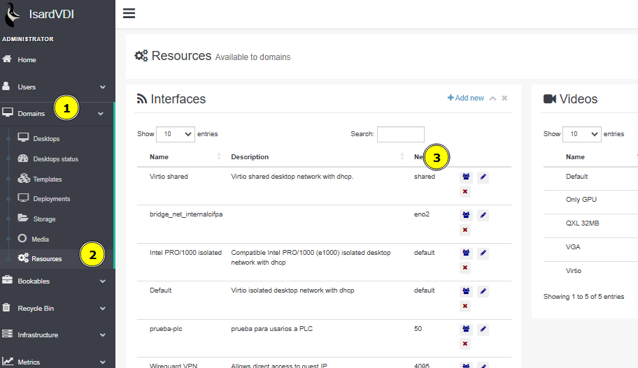

# CREAR REDES en campusvdi

Para crear las redes a los diferentes centros es necesario seguir una seria de pasos.

Necesitas un rol de **Administrador**`

Acceder a la administración > DOMAINS > RESOURCES > INTERFACES

Para llevar un control y orden hay que ordenar las Interfaces por el nombre de la red

### Administración > Domains > Resources > Interfaces

## ORDENAR Y MIRAR POR DEBAJO WIREGUARD VPN 4095

Una vez ordenadas las redes, localizar la primera red por debajo de la llamada con Name “Wireguard VPN” e ID network 4095.

Recordar el numero de Network, en este ejemplo la 2209 (marcada en rojo)

## MIRAR EL NUMERO Y CREAR LA SIGUIENTE RED +1

Una vez apuntado el ID Network, deberemos de crear de manera CORRELATIVA +1 las siguientes redes.

**Añadir nueva interfaz** con las siguientes características:

* TYPE: OpenVSwitch
* Model: Virtio
* Input vlan ID number: +1  de la última por debajo de Wireguard 4095

## UNA VEZ CREADA, COMPARTIR CON CATEGORIA (centro)

Una vez que se ha creado la red, hay que definir la Categoría (Centro) a la que pertenece.

Marcamos la casilla “Set categories” y empezamos a escribir el nombre de la Categoria en el box.

Para finalizar, le damos a **Update** y revisamos que estén todos los campos correctos.
