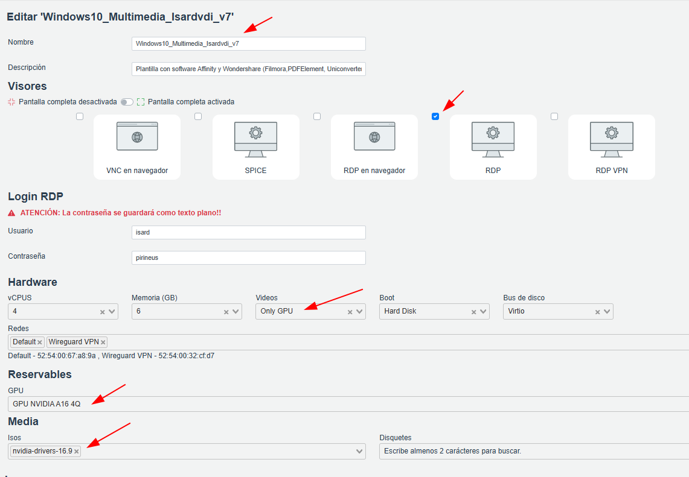

# Instalar/Actualizar DRIVERS NVIDIA VDI

A la hora de actualizar los drivers de NVIDIA, hay que realizar una nueva plantilla.

Necesitas un rol de **Administrador**

Acceder a la administración > DOMAINS > TEMPLATES

Hay que seguir una seria de pasos:

- Localizamos la última plantilla creada por Isardvdi
- Crear Escritorio a partir de esa plantilla
  - Instalar los nuevos drivers NVIDIA (configuración personalizada)
  - Incluir Token de licencia (pedir link a isard)
  - Reinciar
  - Comprobar estado licencia
- Actualizar SO y SW
  - Reiniciar
- Optimizar plantilla con VMwareHorizon Tool
  - Reiniciar
- Pasar propiedad a Isard

## Crear Escritorio a partir de última plantilla funcional

<aside>
ℹ️

Crear Escritorio a partir de plantilla Windows10_Multimedia_Isardvdi_6

Llamarlo Windows10_Multimedia_Isardvdi_7

Copiar descripción de la plantilla anterior.

Configurar: **RDP**, **Only GPU**, **GPU NVIDIA A16 4Q**, medio: **nvidia-drivers-16.9**

</aside>

## Instalar nuevos controladores NVIDIA

<aside>
ℹ️

Ejecutar el instalador 539.19_grid_win10_win11

OK > PERSONALIZAR INSTALACIÓN > REALIZAR UNA INSTALACIÓN CORRECTA

NO REINICIAR !!!

</aside>

<aside>
⚠️

PERSONALIZAR INSTALACION ⚠️  Realizar una instalación correcta (esto desinstala lo antiguo y elimina cualquier perfil anterior)

</aside>

<aside>
⚠️

REALIZAR INSTALACIÓN PERSONALIZADA ⚠️

</aside>

<aside>
⚠️

NO REINICIAR AÚN ⚠️

</aside>

## Incluir token de licencia

Descargar TOKEN de LICENCIA:  (solicitar link a isard)

GUARDAR TOKEN EN ESCRITORIO CREADO:

C:\Program Files\NVIDIA Corporation\vGPU Licensing\ClientConfigToken

REINICIAR LA MAQUINA (ahora si)

## Comprobar estado licencia

EJECUTAR CMD: `nvidia-smi -q | findstr “License”` para ver si está bien licenciado.

EJECUTAR CMD: `nvidia-smi -q`  para ver información detallada.

REINICIAR MÁQUINA

# Actualizar Sistema Operativo

Para actualizar el sistema operativo hay que iniciar la herramienta: *Windows OS Optimization Tool for VMWare Horizon* incluida en el medio: **Optimizations tools**

**Optimizations tools > Actualizar > Desmarcar todas las casillas > Habilitar Windows Update > Ejecutar Windows Update**

Reiniciar y ejecutarlo tantas veces como sea necesario hasta que este todo actualizado.

## Actualizar Software instalado

Para evitar el uso del Windows Store, se propone uso de winget.

## Instalar Winget en Windows 10 / 11 para gestionar SW

Winget te permite instalar/gestionar aplicaciones desde la terminal.

### Opción 1: Descargar y ejecutar

Descarga:

[https://github.com/microsoft/winget-cli/releases/download/v1.6.3482/Microsoft.DesktopAppInstaller_8wekyb3d8bbwe.msixbundle](https://github.com/microsoft/winget-cli/releases/download/v1.6.3482/Microsoft.DesktopAppInstaller_8wekyb3d8bbwe.msixbundle)

Abre PowerShell en el directorio donde se ha descargado y como Admin y ejecutar:

`Add-AppxPackage Microsoft.DesktopAppInstaller_8wekyb3d8bbwe.msixbundle`

Cerrar PowerShell y volver abrirlo y ya dejará instalar desde winget sin el Windows Store.

`winget update`

### Opción 2: Script web

Abrir PowerShell como administrador y ejecutar:

`iex (iwr https://raw.githubusercontent.com/mistik777/Scripts-Windows/refs/heads/main/winget-descargar-e-instalarlo.ps1)`

### Script original

[https://github.com/mistik777/Scripts-Windows/blob/main/winget-descargar-e-instalarlo.ps1](https://github.com/mistik777/Scripts-Windows/blob/main/winget-descargar-e-instalarlo.ps1)

### Ver Software para actualizar con winget

Para ver el software instalado en el equipo y las versiones disponibles:

Abrir CMD o PowerShell y ejecutar: `winget update`

### Actualizar 1 programa en concreto en modo silencioso:

`winget upgrade --silent --accept-source-agreements --accept-package-agreements --id Geany.Genay`

### SCRIPT Pregunta si quieres actualizar uno a uno el Software (por defecto Si)

<aside>
ℹ️

**MODO DE USO**

Abrir PowerShell como Administrador

Copiar y pegar el siguiente código.

Ir eligiendo si se quiere actualizar o no. Por defecto es Sí (presionar Enter)

EL SW que necesita licencia, NO LO ACTUALIZAMOS

OJO al actualizar Virtio-win-gust-tools (te echará de la sesión)

</aside>

[https://github.com/mistik777/Scripts-Windows/blob/main/winget-elegir-que-actualizar.ps1](https://github.com/mistik777/Scripts-Windows/blob/main/winget-elegir-que-actualizar.ps1)

### Si se quiere borrar el historial de PowerShell (recomendable)

[https://github.com/mistik777/Scripts-Windows/blob/main/borrar-historial-powershell.ps1](https://github.com/mistik777/Scripts-Windows/blob/main/borrar-historial-powershell.ps1)

# Optimizar el Escritorio con VMwareHorizon Tool

Optimizar el Escritorio con VMwareHorizon Tool. Apagar Escrtorio > incluir medio.

Seguir pasos del manual oficial >

[Windows 10 installation guide - IsardVDI Documentation](https://isard.gitlab.io/isardvdi-docs/guests/win10/install/#optimization-tools)

# Pasar propiedad de la plantilla a Administrador(admin) - Isard (change own)

Si la plantilla la hemos realizado con un usuario diferente a isard, debemos pasarle a el la propiedad.

En el panel de Administración:

**Domains > Templates > Buscar plantilla > Change Own > buscar usuario > Change owner**

---

### Manual oficial isard:

[vGPU - IsardVDI Documentation](https://isard.gitlab.io/isardvdi-docs/user/gpu.es/#gestion-del-token)

---
