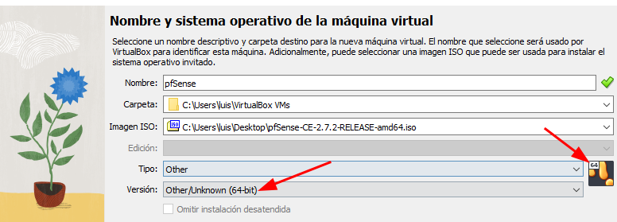

# PRÁCTICA PfSense (router)

# Descarga ISO pfSense

[Download pfSense Community Edition](https://www.pfsense.org/download/)

# Recursos VM PfSense

1CPU

512 MB RAM (mínimo)

5GB VDI HDD (mínimo)

Adaptador Red 1: modo puente  (WAN)

Adaptador Red 2: redinterna (redint)  (LAN)

# Instalación pfSense !!

ℹ️ Adjunto imagen de cómo sería en un VirtualBox. En los escritorios virtuales puedes saltar este paso y realizar la instalación normal

IMPORTANTE!!! INDICAR QUE ES DE 64BITS! sino puede que no os arranque correctamente. 

# Configurar pfSense

Acceso por defecto lo pone en pantalla

## Configurar WAN

DHCP > NO > 192.168.0.200

Mascara /24

GateWay 192.168.0.1

IPv6 NO

revertir http NO

## Configurar LAN

DHCP > NO > 192.168.10.1

Mascara /24 

Gateway NO

IPv6 NO

DHCP server —> (lo hara Zentyal o WinServer). 

Ponemos uno temporal entre 192.168.10.2 y 192.168.10.5

revertir http NO

# Acceder pfSense

Acceder desde navegador web a IP establecida en WAN.

Nuestro caso: 192.168.10.1

# Personalizar configuración pfSense > Wizard

# Securizar pfSense > System > Advanced > Admin Access

HTTPS (SSL/TLS)

TCP port 8001

Anti-lockout 

ssh port 22201

console menu 

Añadir cuenta ADMIN diferente

Quitar cuenta ADMIN por defecto

---

# Manual Instalar pfSense

[Setup Pfsense In Virtual Machine (VirtualBox) | Coy Geek](https://coygeek.com/docs/pfsense-virtualbox/)

Para apagarlo usar la opción 6 —> Halt System

[#pfSense, #WindowsServer y #Zentyal | DC Primario y DC Adicional](https://www.youtube.com/watch?v=mFYDYswsOrA)