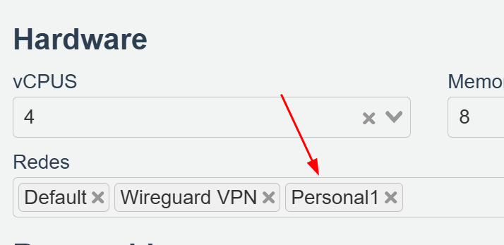

# Servidor web con nginx - Linux

# Añadir redes privadas (Personal1) a los Escritorios

Añadir la red **Personal1** en la configuración de los escritorios que queremos unir a esa red.

# Establecer IP en el Escritorio VDI

Abrimos un terminal y con `ip a` vemos la información de los adaptadores de red

En este caso, vemos que los adaptadores de red corresponde:

**enp1s0 = Default (la que da acceso a internet a los escritorios)**

**enp2s0=Wireguard VPN (la que permite conexión RDP)**

**enp3s0=Personal1 (nuestra red privada)**

### Establecemos valores al adaptador de red enp3s0 (Personal1) en Equipo01

192.168.237.**11** - 255.255.255.0

Una vez aplicada, veremos las direcciones que tiene el Equipo01

### Establecemos valores al adaptador de red enp3s0 (Personal1) en Equipo02

**Una IP en el mismo rango que la anterior pero diferente.**

192.168.237.**55** - 255.255.255.0

# Instalar Servidor Web con nginx en Ubuntu - Equipo01

El el Equipo que queremos que haga de servidor instalaremos nginx:  

`sudo apt install nginx`

Abriremos el navegador desde el equipo cliente y conectaremos con el servidor web nginx que hemos instalado en http://192.168.237.10

<aside>
⚠️

Todos los equipos que estén en la Red: **Privada1**, con la dirección de red y puerto, lo podrán visualizar desde le navegador.

</aside>

### PRECAUCIONES!!

he instalado apache2 y ambos usan puerto 8080!!!

`sudo systemctl stop apache2
sudo systemctl disable apache2`

o configurar puertos diferentes para apache:

`sudo nano /etc/apache2/ports.conf`

o configurar puertos diferentes para nginx:

`sudo nano /etc/nginx/sites-available/default`

reiniciar ambos

`sudo systemctl restart apache2
sudo systemctl restart nginx`

## PRACTICA TUS AVANCES.

- [ ]  Establece que solo sea accesible tu página web a través de un puerto determinado, por ej: 9090
- [ ]  Establece una contraseña de acceso