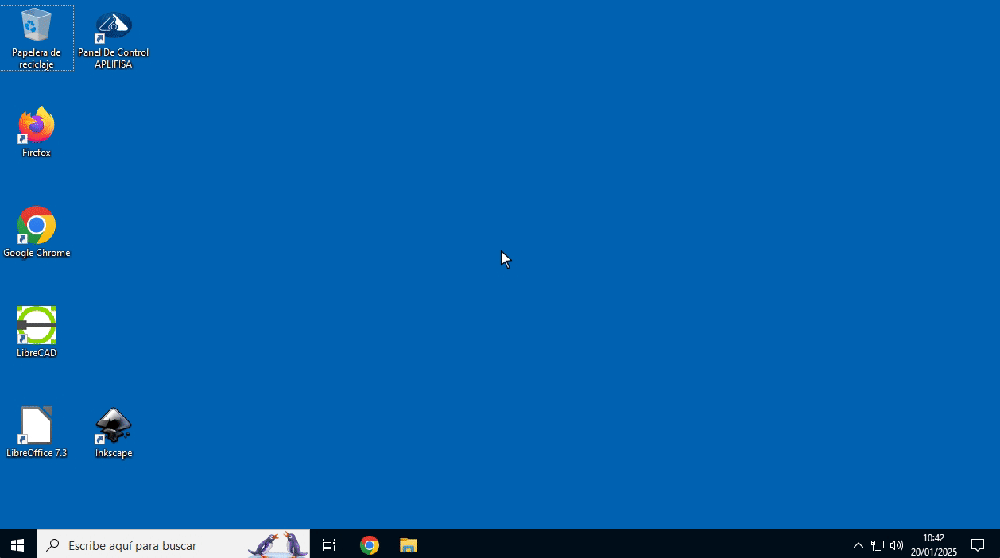

# Carpeta compartida en red + APLIFISA - Windows

# Crear Despliegue

Se crea el despliegue con el programa instalado

# Añadir Redes Despliegue

En la configuración avanzada: revisar que están con las redes correctas

Red Default —> da conexión a Internet

Red Personal —> Hará la conexión privada entre los equipos

# Configurar SERVIDOR

- Establecerle un nombre: SERVIDOR_APLIFISA
- Establecerle una IP fija en el adaptador de red correspondiente (192.168.120.1)
- Verificar que el uso compartido y detección de redes este Activo
- Compartir carpeta en RED

Iniciamos el despliegue y abrimos el Equipo que va ser el SERVIDOR

## Establecer IP fija al equipo que hace de SERVIDOR:

<aside>
💡

El equipo que hace como SERVIDOR, tiene que iniciar sesión con un usuario diferente al de isard. Se ha creado usuario: **aplifisa**

</aside>

Establecer en el adaptador de red correspondiente una IP FIJA: **192.168.120.1** por ejemplo

<aside>
⚠️

REINICIAR EL EQUIPO ⚠️

</aside>

## Compartir Carpeta en Red:

Compartimos la carpeta **C:\aplifisa** en red

<aside>
⚠️

REINICIAR EL EQUIPO ⚠️

</aside>

# Configurar CLIENTES

- Establecerle un nombre: Alumno1 (OPCIONAL)
- Establecerle una IP fija en el adaptador de red correspondiente. CADA ALUMNO UNA DIFERENTE (192.168.120.10, 192.168.120.20, 192.168.120.30 ...)
- Acceder a Carpeta en Red

## Establecer IP fija a cada equipo que hace de CLIENTE:

Establecer el adaptador de red correspondiente una IP FIJA:  **CADA ALUMNO UNA IP DIFERENTE**

Alumno1: 192.168.120.10 

Alumno2: 192.168.120.20 

Alumno3: 192.168.120.30 

…

## Conectar unidad de Red: 192.168.120.1

Conectarse a unidad de red > \\192.168.120.1 y clic en Examinar

