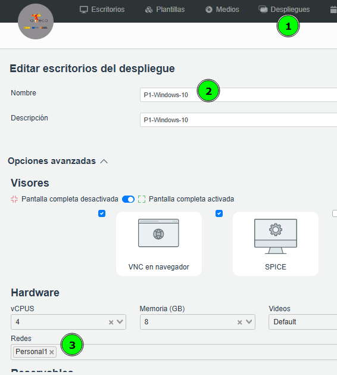

# Cliente-Servidor: Windows 10 - Windows Server 2019

CLIENTE: Windows 10

SERVIDOR: Windows Server 2019

---

# Configuración Despliegue:

Establecer la misma Red en ambas máquinas CLIENTE y SERVIDOR.

En este ejemplo SOLAMENTE les establecemos una red privada: **Personal1**

## CLIENTE (verde)

## SERVIDOR (rojo)

# Establecer IPs en rango correcto cliente y server

Configurar IP de la máquina cliente y servidor con los datos de red correctos

# ¿Mismas IPs Estudiante 01 y Estudiante 02?

Para comprobar conectividad desde ESTUDIANTE01: `ping 173.30.10.20`

Para comprobar conectividad desde ESTUDIANTE02: `ping 173.30.10.10`

> Aunque pongan el mismo rango de red, al ser despliegue no se van a ver porque están aisladas… Es decir, podrían configurar la misma IP del Server pq crea redes independientes
> 

# VIDEO Instalación y configuración Cliente Servidor - Windows Server 2019 - Windows10 en Escritorios Virtuales

[https://www.youtube.com/watch?v=-bwfzkUNOnw](https://www.youtube.com/watch?v=-bwfzkUNOnw)