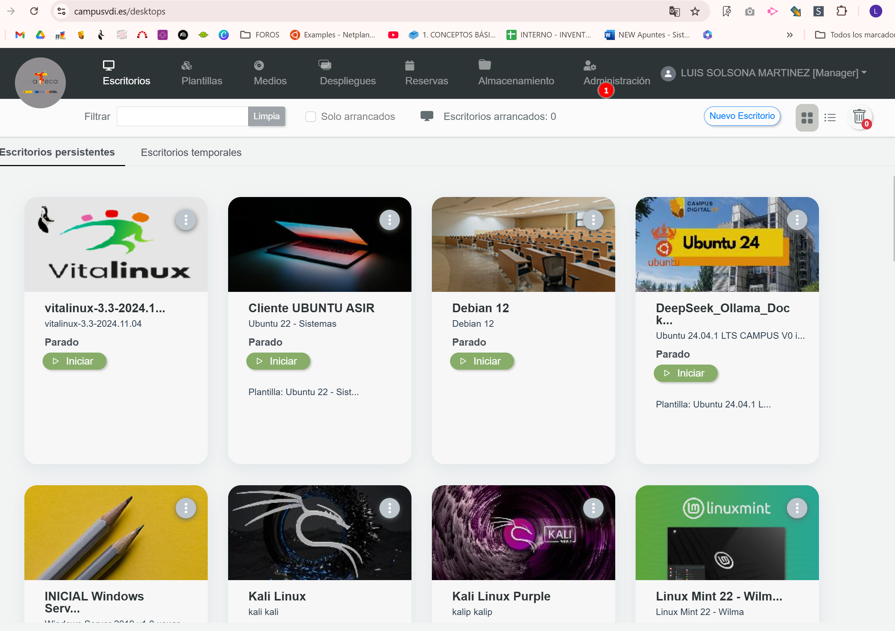

# Crear Grupos y Usuarios

<aside>
☝🏽

Hola Luis!

¿Me puedes crear un grupo en la categoría de CIFPA para este curso que empieza la semana que viene? Sería un profe con 20 estudiantes que tengan desplegada la plantilla de "Varios", donde está el software Landscape 3D sobre el que se va a realizar la formación.

Cuando lo tengas, si puede ser, me pasas listado de usuarios y contraseñas (estándar, sin mucha complejidad).

Gracias!!! Cualquier cosa hablamos.

</aside>

**Categoría** = CENTRO EDUCATIVO

**Grupo** = Los agrupamientos (Por ejemplo clases: 1SMR, 2DAM….)

**Usuarios** = Alumnado, Profes…

**Rol** = *User* para alumnado | Rol = *Advanced* para profes

# Acceder como Manager

[https://www.campusvdi.es/desktops](https://www.campusvdi.es/desktops)

# Crear Grupo

Users >Management > Groups > +Add new

# Crear Usuarios

## Descargar CSV con los campos

Users > Management > Users > DESCARGAR “**CSV for create**” si se quiere **crear usuarios** nuevos

Users > Management > Users > DESCARGAR “**CSV for update**” si se quiere **modificar usuarios** 

## Rellenar datos de usuarios

Lo más rápido y efectivo, abrirlo en HOJAS DE CÁLCULO DE GOOGLE

Rellenar y guardar como CSV

### CSV CREAR USUARIOS

El CSV de crear (bulk-users-export.csv) tiene los siguientes campos a rellenar:

username	name	email	group	category	role

### CSV ACTUALIZAR USUARIOS

El CSV de actualizar (update-from-csv-export.csv)  tiene diferentes campos a rellenar:

active	name	provider	category	uid	username	group	secondary_groups	password

Guardar en formato: Valores separados por comas (.CSV)

