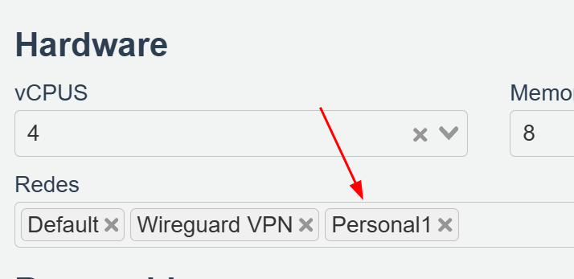

# Servidor web con python - compartir archivos - Linux

# Añadir redes privadas (Personal1) a los Escritorios

Añadir la red **Personal1** en la configuración de los escritorios que queremos unir a esa red.

# Establecer IP en el Escritorio VDI

Abrimos un terminal y con `ip a` vemos la información de los adaptadores de red

En este caso, vemos que los adaptadores de red corresponde:

**enp1s0 = Default (la que da acceso a internet a los escritorios)**

**enp2s0=Wireguard VPN (la que permite conexión RDP)**

**enp3s0=Personal1 (nuestra red privada)**

### Establecemos valores al adaptador de red enp3s0 (Personal1) en Equipo01

192.168.237.**11** - 255.255.255.0

Una vez aplicada, veremos las direcciones que tiene el Equipo01

### Establecemos valores al adaptador de red enp3s0 (Personal1) en Equipo02

**Una IP en el mismo rango que la anterior pero diferente.**

192.168.237.**55** - 255.255.255.0

# Levantar Servidor Web con python en Ubuntu - Equipo01

Nos ubicamos en el directorio a compartir y ejecutamos:

`sudo python3 -m http.server 8085`

Si en ese directorio tenemos un index.html nos mostraría la web o los ficheros que haya en ese directorio 

<aside>
⚠️

Todos los equipos que estén en la Red: **Privada1**, con la dirección de red y puerto, lo podrán visualizar desde le navegador.

</aside>