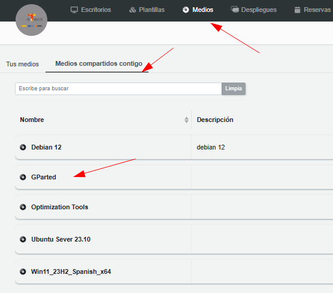

# Práctica particiones con GParted

<aside>
  
👉🏽 Esta práctica consiste en realizar particiones a un disco duro en un sistema operativo ya instalado.

</aside>

<aside>
  
📚 Para ello deberás de:

- [ ]  Configurar el Escritorio Virtual
- [ ]  Establecer un medio y orden de arranque correcto en la máquina
- [ ]  Crear/Modificar particiones del sistema
</aside>

Supongamos que queremos realizar prácticas con discos y particiones. Para ello podemos partir de cualquier plantilla ya existente y crearnos un escritorio. Procederemos a arrancarlo con una ISO ‘live’, nosotros vamos a utilizar GPARTED. [https://gparted.org/](https://gparted.org/)

<aside>
  
ℹ️ **Recuerda**: siempre utiliza **páginas oficiale**s y **software original**

</aside>

Con esta práctica podremos trabajar: 

• **Particiones**: Podremos gestionar particiones en el disco.

• **Volúmenes** lógicos: Creamos un pv en el disco y vg/lv encima.

• **RAID**: Podemos crear particiones en el disco y crear RAID encima.

<aside>
  
🧑🏽‍🏫 PROFE!! Recuerda que puedes **convertirlo en plantilla** para compartirlo con el alumnado.

O si quieres, puedes **convertirlo en despliegue** para tener control sobre los Escritorios.

</aside>

# Incluir el disco GPARTED a nuestros Escritorios

En este caso, el medio ya esta compartido con nosotros, sino bastaría con añadirlo nuevo.

# Arrancamos desde el entorno gráfico.

Elegimos un Escritorio y primero vamos a arrancar con normalidad e intentar crear particiones desde el entorno gráfico. 

Para ello establecemos el orden de arranque desde el disco duro. **`Boot > Hard Disk`**

Abrimos la aplicación DISCOS

Veremos que hay ciertas opciones que no nos permiten hacer

Tendremos que hacerlo con el Sistema Operativo “apagado”…. 

# Modificar Arranque del Escritorio

Establecemos que el Escritorio arranque desde el medio (la iso) que hemos añadido > GParted

**`Boot > CD/DVD`**

# Seguimos los pasos del UI de GParted

Si se ha arrancado desde el medio(iso) de GParted, nos aparecerá una ventana similar a esta…

Elegimos el idioma. Español —> 25

Continuamos en modo gráfico con la opción (0)

Ya podremos trabajar con el disco duro del Escritorio!! 

A partir de aquí ya puedes realizar las particiones, volúmenes…

En este ejemplo vamos a redimensionar para crear otra partición en el Escritorio.

Genial! Parece que todo ha funcionado sin problema…

# Volver a arrancar el Escritorio

Vamos a intentar crear particiones desde el entorno gráfico. Para ello establecemos el orden de arranque desde el disco duro. **`Boot > Hard Disk`**

Y abriendo la aplicación DISCOS ya vemos que tenemos el espacio disponible.

