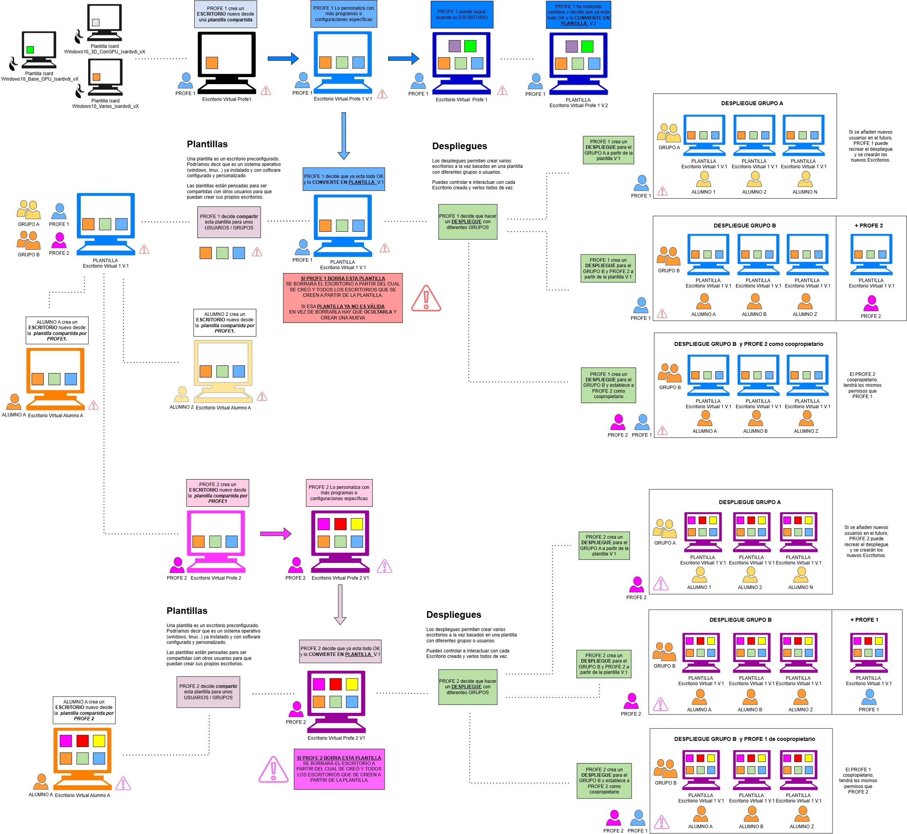

En la siguiente sección encontrarás información variada sobre:

# Adminsitración campusvdi

[Instalar/actualizar Drivers NVIDIA campusvdi](https://github.com/mistik777/Escritorios-Virtuales-campusVDI/blob/main/Instalar-actualizar-Drivers-NVIDIA-campusvdi/Instalar%20Actualizar%20DRIVERS%20NVIDIA%20campusvdi.md)

[Crear centro nuevo campusvdi](https://github.com/mistik777/Escritorios-Virtuales-campusVDI/blob/main/Crear-centro-nuevo-campusvdi/CREAR%20Centros%20nuevos%20en%20campusvdi.md)

[Crear redes campusvid](https://github.com/mistik777/Escritorios-Virtuales-campusVDI/blob/main/Crear-redes-campusvid/CREAR%20REDES%20en%20campusvdi.md)

[Actualizar plantillas campusvdi- cambio de vCPU, RAM, GPU](https://github.com/mistik777/Escritorios-Virtuales-campusVDI/blob/main/Actualizar-plantillas-CPU-RAM-GPU/Actualizar%20plantillas%20-%20cambio%20de%20vCPU%2C%20RAM%20y%20GPU.md)

# Prácticas Managers campusvdi

[Practica Managers - crear Grupos y usuarios](https://github.com/mistik777/Escritorios-Virtuales-campusVDI/blob/main/Practica-Managers-Crear-grupos-usuarios/Practica%20Manager%20Crear%20Grupos%20y%20Usuarios.md)

[Práctica Managers - optimizar Linux y redimensión resolucion pantalla](https://github.com/mistik777/Escritorios-Virtuales-campusVDI/blob/main/Optimizar-linux-pantalla-redimiension/Optimizar%20Distribuciones%20Linux%20en%20Escritorios%20VDI%20%2Bredimension%20pantalla%20completa.md)

# Prácticas Users campusvdi

[Práctica Compartir carpeta en red - APLIFISA](https://github.com/mistik777/Escritorios-Virtuales-campusVDI/blob/main/Practica-APLIFISA-compartir-carpeta-en-red/Carpeta%20compartida%20en%20red%20%2B%20APLIFISA%20-%20Windows%20181ae56fed2e8070b069cd950d96e5c0.md)

[Práctica Particiones disco duro](https://github.com/mistik777/Escritorios-Virtuales-campusVDI/blob/main/Practica-particiones-disco-duro/Pra%CC%81ctica%20particiones%20con%20GParted.md)

[Práctica Cliente-Servidor con Windows Server 2019](https://github.com/mistik777/Escritorios-Virtuales-campusVDI/blob/main/Practica-Cliente-Servidor-Windows/Cliente-Servidor%20Windows%2010%20-%20Windows%20Server%202019.md)

[Práctica Servidor Web con python](https://github.com/mistik777/Escritorios-Virtuales-campusVDI/blob/main/Practica-Servidor%20web%20con%20pyhon%20-%20compartir%20archivos%20-linux/Servidor%20web%20con%20python%20-%20compartir%20archivos%20-%20Linux.md)

[Práctica Servidor Web con Nginx](https://github.com/mistik777/Escritorios-Virtuales-campusVDI/blob/main/Practica%20Servidor%20Web%20con%20Nginx%20-%20Linux/Servidor%20web%20con%20nginx%20-%20Linux.md)

[Práctica Servidor Web con Apache2](https://github.com/mistik777/Escritorios-Virtuales-campusVDI/blob/main/Practica%20Servidor%20Web%20con%20Apache%202%20-%20Linux/Servidor%20web%20con%20Apache2%20-%20Linux.md)

[Práctica PFSense Router](https://github.com/mistik777/Escritorios-Virtuales-campusVDI/blob/main/Practica%20PFSense%20Router/PRA%CC%81CTICA%20PfSense%20-router.md)

# Esquema general funcionamiento campusvdi

En el siguiente Esquema se explica cómo es el funcionamiento general de los Escritorios, Plantillas, Despliegues...

**Uso ideal profesorado:**

1. Elegir una plantilla de las facilitadas por isard
2. Crear un Escritorio a partir de esa plantilla
3. Personaliza al gusto (con más/menos software, configuraciones de red...)
4. Convertir en Nueva Plantilla para profes
   1. Compartir con el alumnado
   2. Convertir en Despliegue al alumnado

**¡¡ CUIDADO AL BORRAR Escritorios / Plantillas!!**

Si se borra una plantilla o escritorio que dependa de otro... se borrará toda la rama!! Revisar en el esquema el icono de alerta ⚠️

*Ejemplo: si borro El Escritorio Virtual Profe 1 V.1 ---> se borrarán todas las Plantillas y Despliegues que dependen de el*

Solución actual: **OCULTAR** dicho escritorio o plantilla y renombrar como "No usar"

# Videos Youtube CampusVDI

Los Escritorios Virtuales VDI (Virtual Desktop Infraestructure) son una solución para centros educativos sin necesidad de invertir en equipos muy potentes o conocimientos muy avanzados.

Crea Escritorios Virtuales para tu alumnado con diferentes sistemas operativos (windows, linux...), crea casos de uso (clases, prácticas, exámentes...) de una manera FÁCIL y RÁPIDA.

Podríamos decir que son equipos online, “en la nube”, con los que se puede trabajar en cualquier lugar (casa o instituto) con una conexión a internet.

Solución para reducir/reutilizar/controlar la gestión de equipos en aulas de cualquier centro educativo.

"Accedo a una web y ya tengo mi ordenador y el de mi alumnado que además puedo controlar."

"Empiezan a trabajar en el instituto y terminar de hacerlo en casa... esta genial!"

## Lista de reproducción Escritorios Virtuales VDI - campusvdi

Link canal: https://www.youtube.com/playlist?list=PLCHVi94WUuMzimBXUnnANV1dd054afK_w

:star:

[Url acceso, Usuario, Contraseñ, Cambiar contraseña](https://www.youtube.com/watch?v=7q_JSsL77D8&list=PLCHVi94WUuMzimBXUnnANV1dd054afK_w&index=1&pp=iAQB)

[Partes de los Escritorios Virtuales](https://www.youtube.com/watch?v=U-Zhb6I-H70&list=PLCHVi94WUuMzimBXUnnANV1dd054afK_w&index=2&pp=iAQB)

[Visores (SPICE, VNC, RDP)](https://www.youtube.com/watch?v=-f94h0S-XH8&list=PLCHVi94WUuMzimBXUnnANV1dd054afK_w&index=3&pp=iAQB)

[Crear, Editar, Configurar Escritorios](https://www.youtube.com/watch?v=bfzO558LH6Q&list=PLCHVi94WUuMzimBXUnnANV1dd054afK_w&index=4&pp=iAQB)

[Plantillas: crear, modificar, eliminar](https://www.youtube.com/watch?v=3TE8l_bJjW8&list=PLCHVi94WUuMzimBXUnnANV1dd054afK_w&index=5&pp=iAQB)

[Medios: isos, imágenes de CD/DVD](https://www.youtube.com/watch?v=0aeA0gQ8XmI&list=PLCHVi94WUuMzimBXUnnANV1dd054afK_w&index=6&pp=iAQB)

[Despliegues: ver y gestionar varios escritorios a la vez](https://www.youtube.com/watch?v=usRf2ON66BI&list=PLCHVi94WUuMzimBXUnnANV1dd054afK_w&index=7&pp=iAQB)

[Rerservas de GPU](https://www.youtube.com/watch?v=a8I_IGN4SfI&list=PLCHVi94WUuMzimBXUnnANV1dd054afK_w&index=8&pp=iAQB)

[Administración : Crear y modificar usuarios y grupos](https://www.youtube.com/watch?v=SX3N1nD2W90&list=PLCHVi94WUuMzimBXUnnANV1dd054afK_w&index=9&pp=iAQB)

[Tipos de Redes (default, Wireguard VPN, Personales, Privadas...)](https://www.youtube.com/watch?v=WWstjR7jpf8&list=PLCHVi94WUuMzimBXUnnANV1dd054afK_w&index=10&pp=iAQB)

[Instalación y configuración Cliente-Servidor](https://www.youtube.com/watch?v=-bwfzkUNOnw&list=PLCHVi94WUuMzimBXUnnANV1dd054afK_w&index=11&pp=iAQB)

[Cambiar claves de usuarios de manera masiva](https://www.youtube.com/watch?v=cYGlcXVsX7I&list=PLCHVi94WUuMzimBXUnnANV1dd054afK_w&index=12&pp=iAQB)

[Ejemplo Instalar un SO: Windows Server 2019](https://www.youtube.com/watch?v=qGb60nOMGSs&list=PLCHVi94WUuMzimBXUnnANV1dd054afK_w&index=13&pp=iAQB)

[Ejemplos de algunos casos de uso](https://www.youtube.com/watch?v=0FzcIOGktlA&list=PLCHVi94WUuMzimBXUnnANV1dd054afK_w&index=14&t=269s&pp=iAQB)